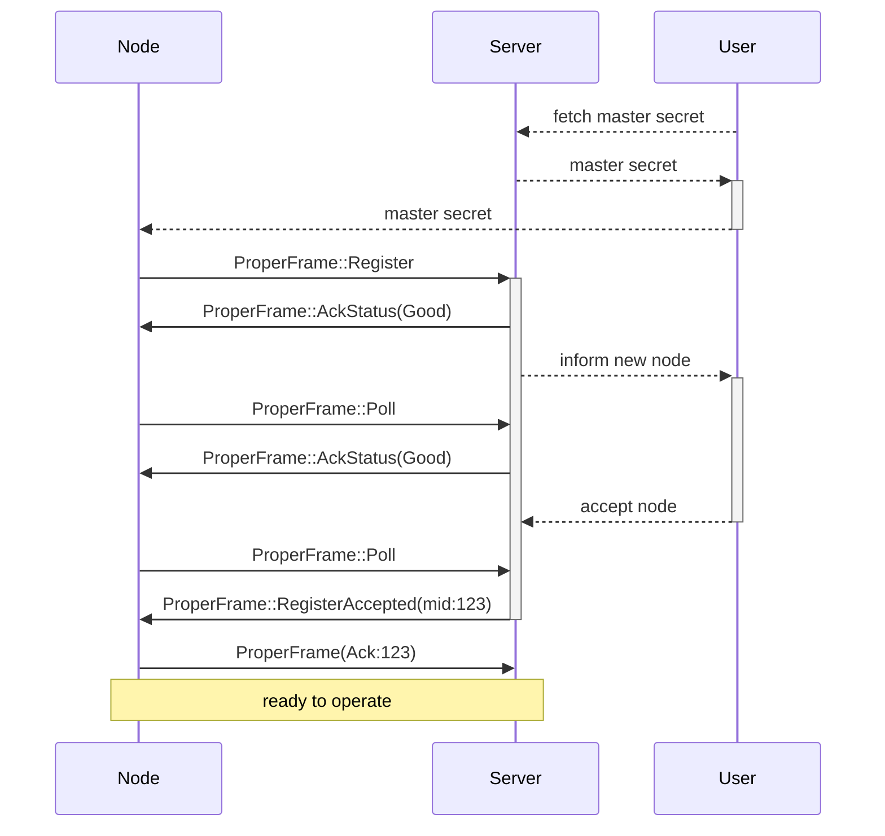
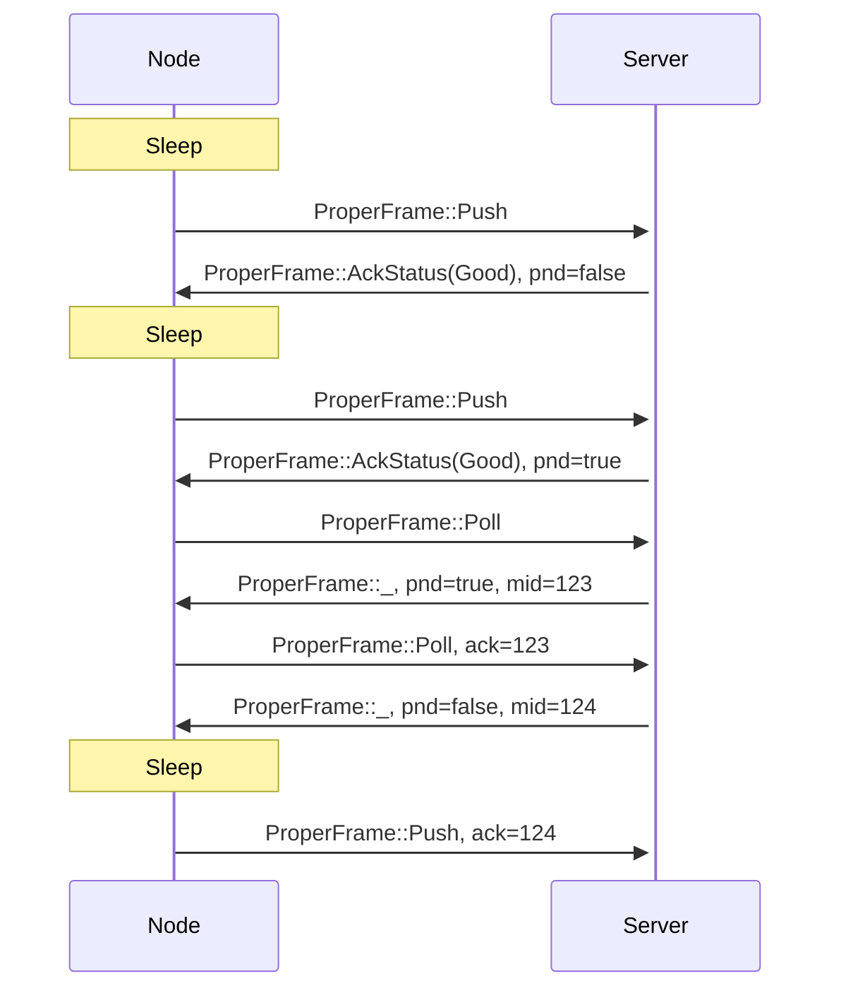

# Proper Messaging Flows

This document is meant to be the reference for specific messaging flows.

## Registering new node

This flow is used when new node is registered to the automation system.
This can be entirely new device or factory resetted existing device.

## Node pushing and polling

This flow describes how Nodes push data to server and poll for pending messages
if server indicates such messages are available via pnd boolean flag. Also this
demonstrates how ack field is used in ProperFrame and how Server responds with
AckStatus messages.

