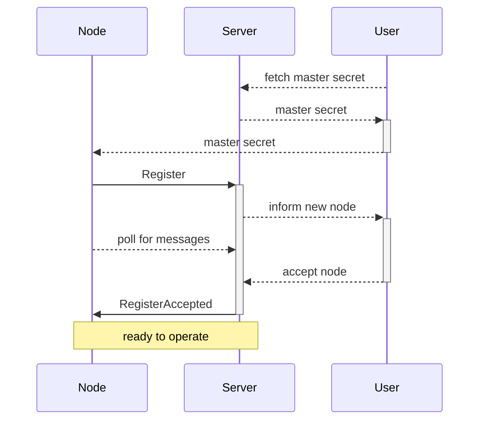

# Proper Messaging Flows

This document is meant to be the reference for specific messaging flows.

## Registering new node

This flow is used when new node is registered to the automation system.
This can be entirely new device or factory resetted existing device.

