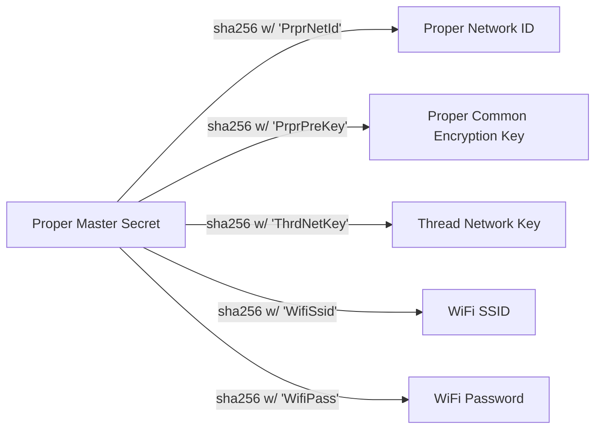

# Proper Home Automation

Documentation links:
- [Message flows](/flows.md)

## Overview

Proper Home Automation is standard for home automation system and nodes. It defines protocol
for communication between nodes and automation servers, service discovery and the network layout used
for home automation system.

Aim of this standard is to define easy to implement, local, open and powerful protocol for home
automation systems. Protocol is defined in Rust, but it supports implementations on hobbyists
systems like arduino or esp32.

Proper is based on IPv6 and natively supports sleepy battery-operated nodes. High level model is that
nodes poll the automation servers for pushing measurement data and also check if there's any messages
for them. This approach allows the nodes to define how much they sleep to conserver power.

The networks is fully isolated IPv6 network which connects nodes and automation servers. The automation
servers are allowed to be also connected to external networks with other interfaces, but the automation
network should not be connected to any external networks. Proper supports Thread networks via Thread
border gateways. Higher power nodes are supported via Wifi or Ethernet connectivity. IPv4 may be
supported for these higher power nodes, but IPv6 is preferred due to it's native redundant routing
capability.

Service discovery is via mDNS and DNS-SD. Proper uses well known ports and services which the nodes
utilize to locate the automation servers.

Secrets management is made to be as simple as possible for the users. One shared master secret is
defined, which is used to derive:
- Proper network id
- Proper pre-approval encryption pre-shared key
- Thread network key
- Wifi SSID and password

Node is configured with the master secret (via serial, QR-code, bluetooth, light?) and then it derives
the necessary keys for itself. Node uses that information to join the network and register itself to
automation servers. The automation servers then ask user for permission to add new node to the system.
After user approval, the automation server creates outbox message for the node which allows it to join
the automation system. While waiting for approval, the node polls the server for messages.

Redundancy is supported on multiple levels and reliability is paramount. IPv6 is used to allow multiple
routes for the nodes for reaching the automation servers. Thread network supports these redundant features
for power restricted nodes. Wifi also supports multiple access points for redundant access to the network.
Service discovery natively supports multiple servers (and even multiple proper networks). No connection
to internet should ever be required, no single point of failure should ever exist.

Message protocols used are CoAP/DTLS/Messagepack for power restricted nodes and HTTPS/TLS/JSON for higher
power nodes. These protocols are selected for the use cases in mind, but they are similar in how they
operate which allows easier way to support both in the Proper specifications.

## Service Discovery

Proper Home Automation use service "prpr" for service discovery via mDNS and DS-SD.

Service Discovery is used by the nodes to find Automation Servers to communicate with.
Automation Servers can use Service Discovery to find other servers for redundancy configuration.

```txt
Namespace:
        _prpr._tcp.local
        _prpr._udp.local

Server service type:
        hasrv._prpr._tcp.local
        hasrv._prpr._udp.local

Server instance name:
        {server}.hasrv._prpr._tcp.local
        {server}.hasrv._prpr._udp.local
```

## Security Model

As stated in the overview, Proper Home Automation relies on pre-shared keys in form of proper
master secret.

While the current state of the art of home automation protocols (Thread and such) have very
secure setups for key management, they also are extremely complicated and enterprisey. I should
not attribute this to malice, but it seems that in practice that great security is used to keep
users locked inside company-specific ecosystems.

Using single network specific proper master secret is not as secure. But it is _a lot_ simpler.
- It allows the protocol to derive other required keys automatically, instead of bothering the user.  
- It effectively prevents moats, which is _extremely_ important. This needs to be available for
anyone to implement.
- It makes the node configuration simple. They just need any way to get one proper master secret
on device. Hard-coding for DIY? QR-codes for camera-enabled nodes? Bluetooth configuration? blinking
lights for serial data transfer to cheap light dependat resistor? So. Many. Options.

:information_source: I know, I know. Losing single device could compromise the master secret for
the entire automation network. I'll try to think of a way to lessen this risk. Maybe the devices
could only store the proper master secret until approval, and after that they could store just the
derived keys they'd need..

### Key derivation

There is only single configurable secret in Proper Home Automation: proper master secret. This
secret is used to derive all other secrets and/or identifiers that are needed to connect to
proper home automation system. This shared secret will also be used for encryption up to node
approval. After that, node specific random pre-shared key is used for encryption.

On high-level, the idea for key derivations is as follows. In more detailed documentation you'll
note that the derivation will be a bit more complicated so that things such as Wifi SSID look
nice to the user.



### Low power nodes (LPN)

```txt
UDP -> DTLS-PSK -> CoAP -> MessagePack
```

For all messages DTLS (in PSK mode) is used for encryption. This is used for message integrity,
confidentiality and authenticity. DTLS allows automation server to be certain that the message
is from trusted source, that the message has not been tampered with and that the message is
received complete.

Pre-shared key used here is derived from proper master secret for pre-approval messages.
Pre-shared key used here is node-specific secret received from automation server on approval.

Using PSK simplifies the power and memory requirements and it makes the security setup much
simpler. Using node specific key allows the messages to be attributed properly even when
node ip-addresses might change.

### High power nodes (HPN)

```txt
TCP -> TLS-PSK -> HTTPS -> JSON
```

For all messages TLS (in PSK mode) is used for encryption. This is used for message integrity,
confidentiality and authenticity. TLS allows automation server to be certain that the message
is from trusted source, that the message has not been tampered with and that the message is
received complete.

Pre-shared key used here is derived from proper master secret for pre-approval messages.
Pre-shared key used here is node-specific secret received from automation server on approval.

Using node specific key allows the messages to be attributed properly even when
node ip-addresses might change. Keeping the HPN security flows closely aligned with LPN ones
simplifies the protocol specification significantly.